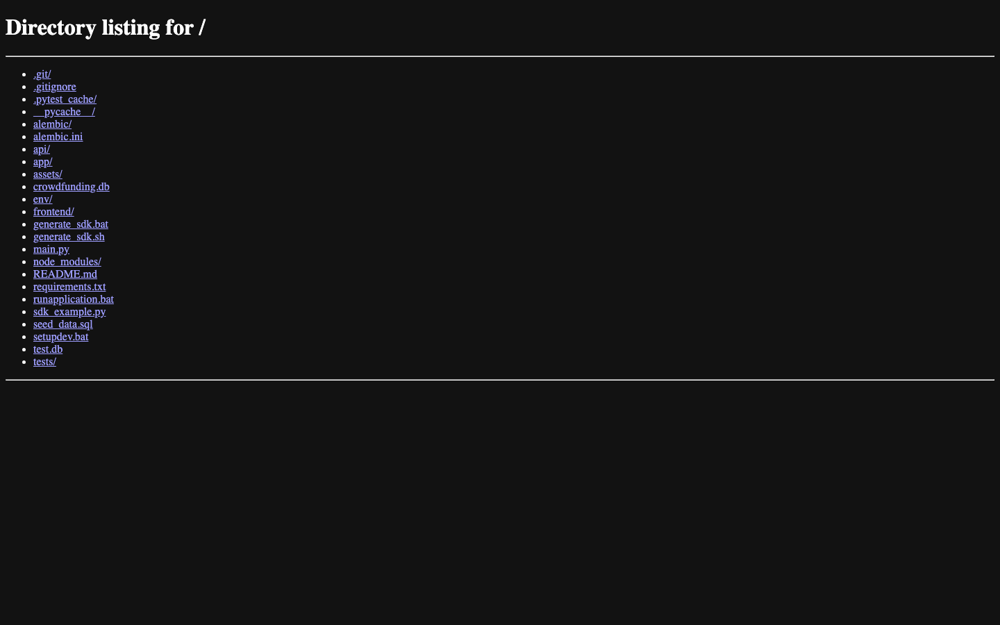

# Crowdfunding Platform (FastAPI + React + SQLite)

This project implements an intern coding challenge crowdfunding platform with:
- FastAPI backend + OpenAPI docs
- SQLite + Alembic migrations
- React frontend (Axios API integration)
- Unit tests for backend logic
- SDK generation workflow via OpenAPI Generator CLI
- Windows setup and run batch scripts

## Application Screenshot



## Features

- Create campaigns: `POST /campaigns/`
- Pledge to campaign: `POST /campaigns/{id}/pledge`
- List campaigns/progress: `GET /campaigns/`
- Refund expired campaigns that did not hit goal: `POST /campaigns/{id}/refunds`
- Frontend real-time updates (auto-refresh every 5 seconds)
- Frontend funding chart visualization (bonus)

### Business rules enforced

- Prevent overfunding (pledges that exceed goal are rejected with `400`)
- Reject pledges after deadline
- Refunds allowed only if campaign expired and goal was not met
- Refund operation resets pledged amount and clears stored pledges for that campaign

## Project Structure

- `main.py` - FastAPI app and routes
- `app/` - database/session, models, schemas, CRUD/domain logic
- `alembic/` - migration config and versions
- `tests/` - backend unit tests
- `frontend/` - React app
- `seed_data.sql` - sample SQL seed data
- `setupdev.bat` - setup automation for Windows
- `runapplication.bat` - run backend and frontend for Windows

## Backend Setup

1. Create and activate virtual environment:
   - Windows:
     - `python -m venv env`
     - `env\Scripts\activate`
   - macOS/Linux:
     - `python -m venv env`
     - `source env/bin/activate`
2. Install dependencies:
   - `pip install -r requirements.txt`
3. Run migrations:
   - `alembic upgrade head`
4. (Optional) seed sample data:
   - `sqlite3 crowdfunding.db < seed_data.sql`
5. Start backend:
   - `uvicorn main:app --reload`

OpenAPI docs are available at:
- `http://localhost:8000/docs`
- `http://localhost:8000/openapi.json`

## Frontend Setup

1. `cd frontend`
2. `npm install`
3. `npm start`

Frontend expects API at `http://localhost:8000` by default.
Override with env var:
- `REACT_APP_API_BASE_URL=http://your-host:8000`

## Running Tests

- `pytest -q`

## Generate Python SDK (OpenAPI Generator CLI)

With backend running on `localhost:8000`:

```bash
npm install -g @openapitools/openapi-generator-cli
openapi-generator-cli generate -i http://localhost:8000/openapi.json -g python -o crowd_sdk
```

Or run helper script:

```bash
./generate_sdk.sh
```

After generation, example usage:

```python
from crowd_sdk import ApiClient
from crowd_sdk.api.default_api import DefaultApi

client = ApiClient()
api = DefaultApi(client)
campaigns = api.get_campaigns_campaigns_get()
print(campaigns)
```

## Windows Scripts

- Setup everything:
  - `setupdev.bat`
- Run application:
  - `runapplication.bat`

## Notes

- Docker is not used.
- Error handling returns clear `4xx` responses for business-rule violations.
- Backend uses dependency injection (`Depends(get_db)`) for DB sessions.
- Frontend uses only API calls and does not access DB directly.
